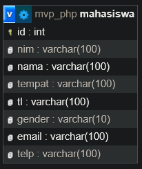
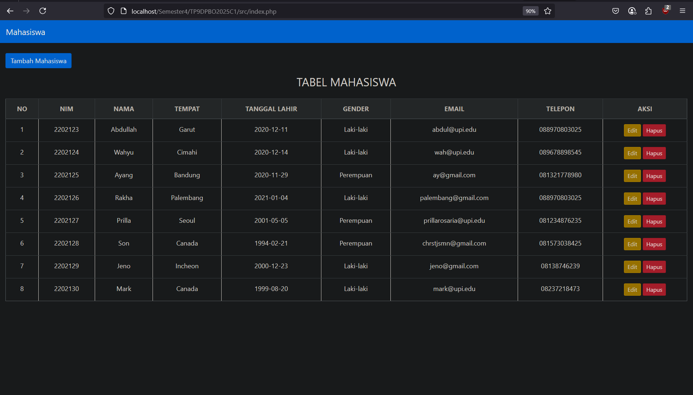
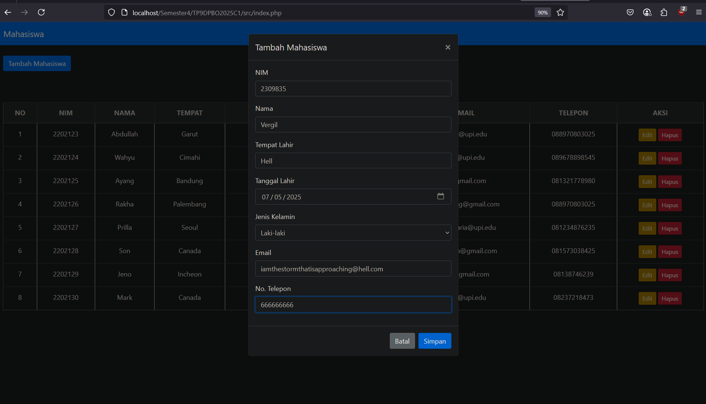
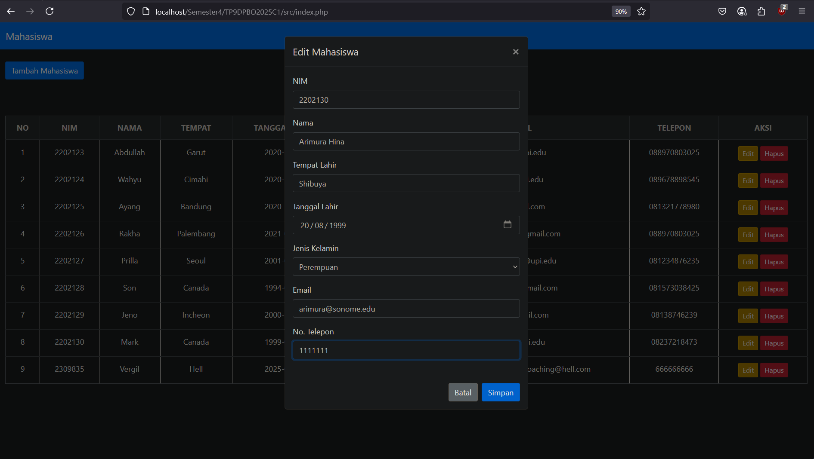
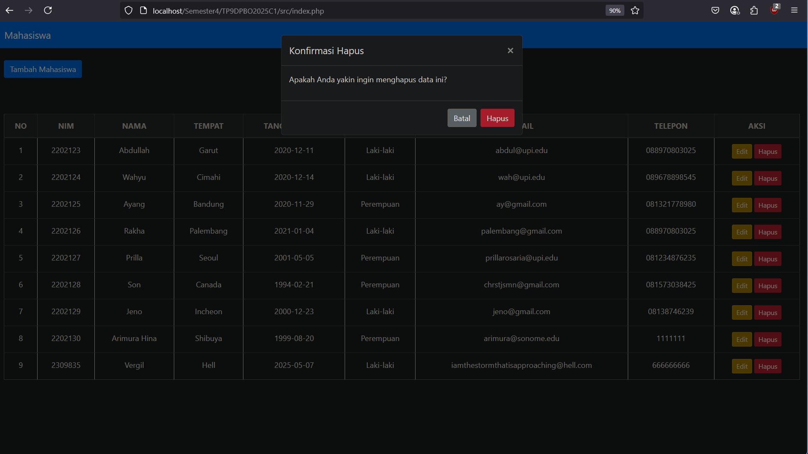
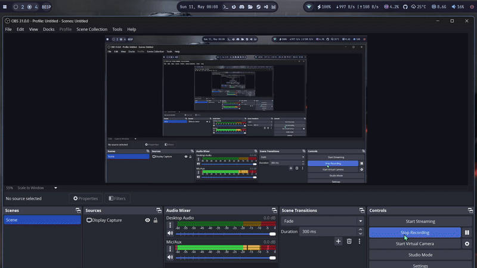

# Sistem Manajemen Mahasiswa (MVP PHP)

## Janji

Saya Lyan Nazhabil Dzuquwwa dengan NIM 2308428 mengerjakan Tugas Praktikum 9 dalam mata kuliah Desain dan Pemrograman Berorientasi Objek untuk keberkahanNya maka saya tidak melakukan kecurangan seperti yang telah dispesifikasikan. Aamiin.

## Diagram
Berikut merupakan Diagram Desain dari program (MVP):

## Desain Program

Program ini mengimplementasikan sistem manajemen data mahasiswa menggunakan pola desain Model-View-Presenter (MVP) dengan PHP. Terdapat beberapa kelas utama yang dibagi menjadi komponen Model, View, dan Presenter:

### Model
Komponen Model bertanggung jawab untuk mengelola data dan logika bisnis terkait data.
1.  **[`Mahasiswa.class.php`](src/model/Mahasiswa.class.php)** - Kelas entitas yang merepresentasikan data seorang mahasiswa.
    *   Atribut: `id`, `nim`, `nama`, `tempat`, `tl` (tanggal lahir), `gender`, `email`, `telp`.
    *   Method: Constructor, Getters (`getId()`, `getNim()`, dll.), Setters (`setId()`, `setNim()`, dll.).
2.  **[`DB.class.php`](src/model/DB.class.php)** - Kelas untuk mengelola koneksi dan interaksi dasar dengan database MySQL.
    *   Atribut: `db_host`, `db_user`, `db_password`, `db_name`, `db_link`, `result`.
    *   Method: `__construct()`, `open()` (membuka koneksi), `execute()` (menjalankan query), `getResult()` (mengambil hasil query), `close()` (menutup koneksi).
3.  **[`TabelMahasiswa.class.php`](src/model/TabelMahasiswa.class.php)** - Kelas yang menangani operasi CRUD (Create, Read, Update, Delete) pada tabel `mahasiswa` di database. Kelas ini merupakan turunan dari `DB`.
    *   Method: `getMahasiswa()` (mengambil semua data mahasiswa), `getMahasiswaById()` (mengambil data mahasiswa berdasarkan ID), `addMahasiswa()` (menambah data mahasiswa), `updateMahasiswa()` (memperbarui data mahasiswa), `deleteMahasiswa()` (menghapus data mahasiswa).
4.  **[`Template.class.php`](src/model/Template.class.php)** - Kelas untuk mengelola _template_ HTML.
    *   Atribut: `filename`, `content`.
    *   Method: `__construct()` (memuat file _template_), `clear()` (membersihkan _placeholder_), `write()` (menampilkan konten ke layar), `getContent()` (mengambil konten yang sudah diproses), `replace()` (mengganti _placeholder_ dengan data).

### View
Komponen View bertanggung jawab untuk menampilkan data kepada pengguna.
1.  **[`TampilMahasiswa.php`](src/view/TampilMahasiswa.php)** - Kelas yang menampilkan data mahasiswa dalam bentuk tabel dan menyediakan antarmuka untuk interaksi pengguna (form tambah/edit). Kelas ini mengimplementasikan [`KontrakView`](src/view/KontrakView.php).
    *   Atribut: `prosesmahasiswa` (objek presenter), `tpl` (objek template).
    *   Method: `__construct()`, `tampil()` (memproses dan menampilkan data mahasiswa).
2.  **[`KontrakView.php`](src/view/KontrakView.php)** - _Interface_ yang mendefinisikan kontrak untuk kelas View.
    *   Method: `tampil()`.
3.  **[`templates/skin.html`](src/templates/skin.html)** - File _template_ HTML yang mendefinisikan struktur tata letak halaman web, termasuk tabel dan modal untuk form.

### Presenter
Komponen Presenter bertindak sebagai perantara antara Model dan View.
1.  **[`ProsesMahasiswa.php`](src/presenter/ProsesMahasiswa.php)** - Kelas yang menangani logika aplikasi, memproses input pengguna dari View, berinteraksi dengan Model untuk mengambil atau memanipulasi data, dan kemudian memperbarui View. Kelas ini mengimplementasikan [`KontrakPresenter`](src/presenter/KontrakPresenter.php).
    *   Atribut: `tabelmahasiswa` (objek model `TabelMahasiswa`), `data` (array untuk menyimpan objek `Mahasiswa`).
    *   Method: `__construct()`, `prosesDataMahasiswa()` (mengambil semua data mahasiswa dari model), `getDataById()` (mengambil data mahasiswa spesifik), `add()` (menambah mahasiswa), `update()` (memperbarui mahasiswa), `delete()` (menghapus mahasiswa), serta _getter_ untuk atribut mahasiswa (`getId()`, `getNim()`, dll.) dan `getSize()`.
2.  **[`KontrakPresenter.php`](src/presenter/KontrakPresenter.php)** - _Interface_ yang mendefinisikan kontrak untuk kelas Presenter.
    *   Method: `prosesDataMahasiswa()`, `getId()`, `getNim()`, `getNama()`, `getTempat()`, `getTl()`, `getGender()`, `getEmail()`, `getTelp()`, `getSize()`, `add()`, `update()`, `delete()`, `getDataById()`.

## Alur Program

Program dimulai dari file [`src/index.php`](src/index.php) yang bertindak sebagai _controller_ utama untuk menangani permintaan HTTP dan mengarahkan operasi CRUD.

1.  **Menampilkan Data Mahasiswa (Read)**
    Halaman utama menampilkan daftar seluruh mahasiswa yang ada di database dalam bentuk tabel.
    

2.  **Menambah Data Mahasiswa (Create)**
    Pengguna dapat menambah data mahasiswa baru dengan mengklik tombol "Tambah Mahasiswa". Sebuah modal akan muncul berisi form untuk diisi.
    

3.  **Mengubah Data Mahasiswa (Update)**
    Untuk mengubah data mahasiswa yang sudah ada, pengguna dapat mengklik tombol "Edit" pada baris mahasiswa yang diinginkan. Modal akan muncul dengan form yang sudah terisi data mahasiswa tersebut.
    

4.  **Menghapus Data Mahasiswa (Delete)**
    Pengguna dapat menghapus data mahasiswa dengan mengklik tombol "Hapus" pada baris mahasiswa yang diinginkan. Sebuah modal konfirmasi akan muncul sebelum data dihapus.
    

## Dokumentasi
Berikut adalah demo singkat dari fungsionalitas website:
